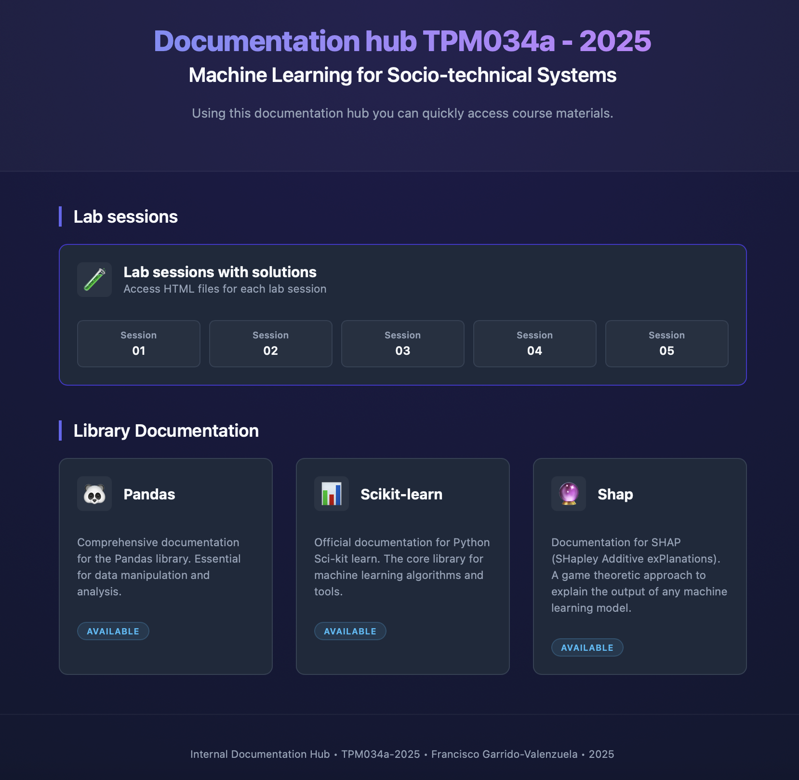

# TPM34a Internal Hub

For "deploying" just position the `index.html` next to `docs` folder. Once you open the html with the web-broser, you can navigate over the files.

Here is the sample of the page:


## Adding more docs

To add documentation for a new library, follow these steps:

1. **Clone the repository of the library**
   Clone the source code of the library you want to document.
   ```bash
   git clone https://github.com/username/library-name.git
   cd library-name
   ```

2. **Checkout the specific version**
   Switch to the branch or tag corresponding to the version you want to document.
   ```bash
   git checkout tags/v1.0.0  # Replace with the desired version tag
   ```

3. **Create a clean Python environment**
   It is recommended to use a fresh environment to avoid conflicts.
   ```bash
   python -m venv .venv
   source .venv/bin/activate
   ```

4. **Install the library**
   Install the library in editable mode or normally.
   ```bash
   pip install -e .
   # Or for a specific version from PyPI if not building from source:
   # pip install library-name==1.0.0
   ```

5. **Install documentation dependencies**
   Navigate to the `docs` directory and install requirements.
   ```bash
   cd docs
   pip install -r requirements.txt
   # If no requirements.txt exists, you might need to install sphinx manually:
   # pip install sphinx sphinx_rtd_theme
   ```

6. **Build the HTML documentation**
   Use `make` to generate the HTML files.
   ```bash
   make html
   ```

7. **Locate the generated files**
   If the build is successful, the HTML files will be in the build directory.
   ```bash
   # Usually located at:
   # _build/html/
   ```
   Copy the contents of `_build/html/` to a new folder in `Documentation-hub/docs/library-name/`.


